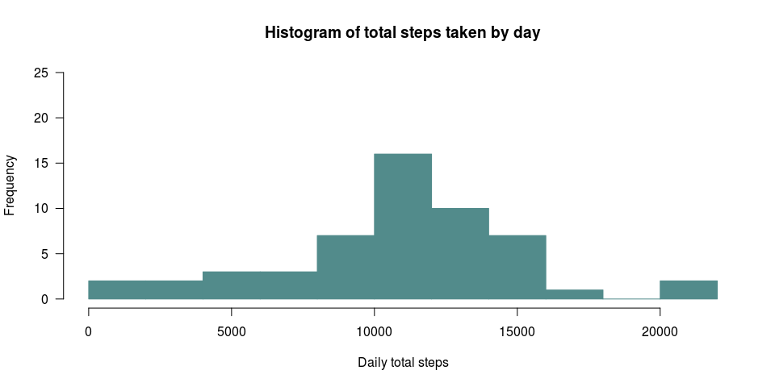
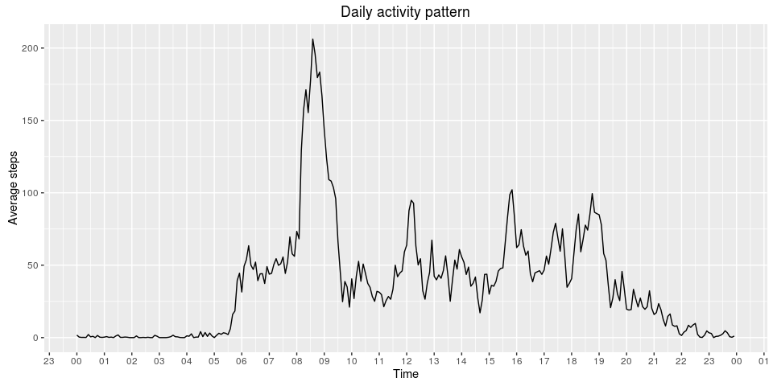
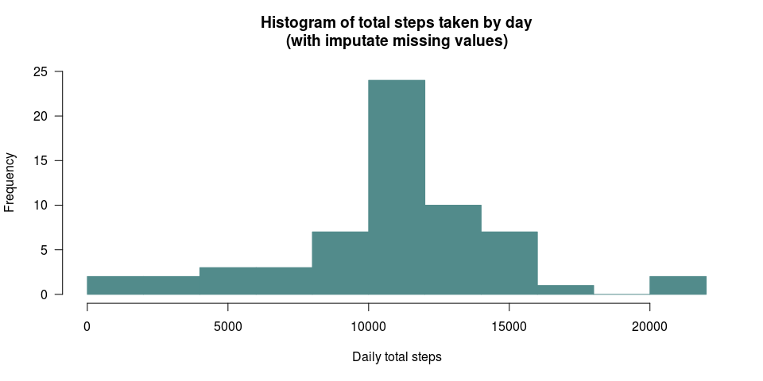

# Reproducible Research: Peer Assessment 1


## Loading and preprocessing the data

Nowadays there are a lot of devices that collect information about personal activity. In this assigment we are going to make some exploratory data analysis in a dataset consist of the number of steps taken in a 5 minutes interval from an anonymous individual, collected each day during October and November of 2012.

First of all we are going to load the activity dataset and take a look it.


```r
dfsteps <- read.csv(unz("activity.zip", "activity.csv"), header=T)
str(dfsteps)
```

```
## 'data.frame':	17568 obs. of  3 variables:
##  $ steps   : int  NA NA NA NA NA NA NA NA NA NA ...
##  $ date    : Factor w/ 61 levels "2012-10-01","2012-10-02",..: 1 1 1 1 1 1 1 1 1 1 ...
##  $ interval: int  0 5 10 15 20 25 30 35 40 45 ...
```

The dataset is a data frame with 3 variables and 17568 observations. The variables included in this dataset are:

- `$steps`: an integer variable that shows the number of steps taking in a 5-minute interval (missing values are coded as NA)
- `$date`: a factor variable with the date on which the measurement was taken in YYYY-MM-DD format. The variable has 61 levels, one for each day along October and November months.
- `$interval`: an integer variable that identify the 5-minute interval in which measurement was taken.

Let's go to extract a summary.


```r
summary(dfsteps)
```

```
##      steps                date          interval     
##  Min.   :  0.00   2012-10-01:  288   Min.   :   0.0  
##  1st Qu.:  0.00   2012-10-02:  288   1st Qu.: 588.8  
##  Median :  0.00   2012-10-03:  288   Median :1177.5  
##  Mean   : 37.38   2012-10-04:  288   Mean   :1177.5  
##  3rd Qu.: 12.00   2012-10-05:  288   3rd Qu.:1766.2  
##  Max.   :806.00   2012-10-06:  288   Max.   :2355.0  
##  NA's   :2304     (Other)   :15840
```

The summary shows that the minimum number of steps in a 5-minute interval is zero, and the maximum is 806. The mean of steps in a 5-minute interval is 37.38, and the median is zero. And there are 2304 NAs, that means that we have 2304 5-minute intervals without information.

About `$date`variable, it seems that there are 288 entries for each unique day. That would have sense, because there are 288 intervals of 5 minutes in a day. Let's go check it.


```r
unique(summary(dfsteps$date))
```

```
## [1] 288
```

Yes, we have 288 entries for each level of `$date`.

About `$interval` variable, the minimum is zero and the maximum is 2355. That is strange, because if you start in zero and add 287 intervals of 5 minutes each (the amount of intervals of 5 minutes on a day), the maximum expected would be 1435.

Let's go to examine `$interval` more deep in.


```r
unique(dfsteps$interval)
```

```
##   [1]    0    5   10   15   20   25   30   35   40   45   50   55  100  105
##  [15]  110  115  120  125  130  135  140  145  150  155  200  205  210  215
##  [29]  220  225  230  235  240  245  250  255  300  305  310  315  320  325
##  [43]  330  335  340  345  350  355  400  405  410  415  420  425  430  435
##  [57]  440  445  450  455  500  505  510  515  520  525  530  535  540  545
##  [71]  550  555  600  605  610  615  620  625  630  635  640  645  650  655
##  [85]  700  705  710  715  720  725  730  735  740  745  750  755  800  805
##  [99]  810  815  820  825  830  835  840  845  850  855  900  905  910  915
## [113]  920  925  930  935  940  945  950  955 1000 1005 1010 1015 1020 1025
## [127] 1030 1035 1040 1045 1050 1055 1100 1105 1110 1115 1120 1125 1130 1135
## [141] 1140 1145 1150 1155 1200 1205 1210 1215 1220 1225 1230 1235 1240 1245
## [155] 1250 1255 1300 1305 1310 1315 1320 1325 1330 1335 1340 1345 1350 1355
## [169] 1400 1405 1410 1415 1420 1425 1430 1435 1440 1445 1450 1455 1500 1505
## [183] 1510 1515 1520 1525 1530 1535 1540 1545 1550 1555 1600 1605 1610 1615
## [197] 1620 1625 1630 1635 1640 1645 1650 1655 1700 1705 1710 1715 1720 1725
## [211] 1730 1735 1740 1745 1750 1755 1800 1805 1810 1815 1820 1825 1830 1835
## [225] 1840 1845 1850 1855 1900 1905 1910 1915 1920 1925 1930 1935 1940 1945
## [239] 1950 1955 2000 2005 2010 2015 2020 2025 2030 2035 2040 2045 2050 2055
## [253] 2100 2105 2110 2115 2120 2125 2130 2135 2140 2145 2150 2155 2200 2205
## [267] 2210 2215 2220 2225 2230 2235 2240 2245 2250 2255 2300 2305 2310 2315
## [281] 2320 2325 2330 2335 2340 2345 2350 2355
```

When the identifier reaches 55, the next integer is 100. When reaches 155 the next is 200. And so on. There are not tens above 55. After ten 55, it goes to the next hundred, or thousand number. This is because the identifier is playing like a timer, measuring the 5-minute intervals into an hour. When the timer reaches 55 minutes, the next time is not 60 minutes, but 1 hour and 0 minutes, expressed like 100. It is the same for 155 (1 hour and 55 minutes): the next time is 200 (2 hours and 0 minutes).

The identifier allows to know the hour and minute where the interval was collected. So, 0 stand for 00:00:00, 450 stand for 04:50:00, 1430 stand for 14:30:00, and so on.


## What is mean total number of steps taken per day?

First we will calculate the total steps taken each day, and we will save on a data frame.


```r
stepsbyday <- setNames(aggregate(steps~date, dfsteps, sum), c("day", "total.steps"))
```

Now, lets to make the histogram, choosing the Freedman-Diaconis rule to set the bin-width, one of options of the argument `breaks` on `hist` function. 


```r
hist(stepsbyday$total.steps, main = "Histogram of total steps taken by day", xlab = "Daily total steps", ylim = c(0, 25), las = 1, breaks = "FD", col = "darkslategray4", border = "darkslategray4")
```

<!-- -->

The plot shows that there is a higher frequency of days in which was taken between 10000 and about 12500 steps.

Let's see the mean and median of steps taken each day along October and November.


```r
aggregate(steps~date, dfsteps, function(x) c(mean = mean(x), median = median(x)), na.action = NULL)
```

```
##          date steps.mean steps.median
## 1  2012-10-01         NA           NA
## 2  2012-10-02  0.4375000    0.0000000
## 3  2012-10-03 39.4166667    0.0000000
## 4  2012-10-04 42.0694444    0.0000000
## 5  2012-10-05 46.1597222    0.0000000
## 6  2012-10-06 53.5416667    0.0000000
## 7  2012-10-07 38.2465278    0.0000000
## 8  2012-10-08         NA           NA
## 9  2012-10-09 44.4826389    0.0000000
## 10 2012-10-10 34.3750000    0.0000000
## 11 2012-10-11 35.7777778    0.0000000
## 12 2012-10-12 60.3541667    0.0000000
## 13 2012-10-13 43.1458333    0.0000000
## 14 2012-10-14 52.4236111    0.0000000
## 15 2012-10-15 35.2048611    0.0000000
## 16 2012-10-16 52.3750000    0.0000000
## 17 2012-10-17 46.7083333    0.0000000
## 18 2012-10-18 34.9166667    0.0000000
## 19 2012-10-19 41.0729167    0.0000000
## 20 2012-10-20 36.0937500    0.0000000
## 21 2012-10-21 30.6284722    0.0000000
## 22 2012-10-22 46.7361111    0.0000000
## 23 2012-10-23 30.9652778    0.0000000
## 24 2012-10-24 29.0104167    0.0000000
## 25 2012-10-25  8.6527778    0.0000000
## 26 2012-10-26 23.5347222    0.0000000
## 27 2012-10-27 35.1354167    0.0000000
## 28 2012-10-28 39.7847222    0.0000000
## 29 2012-10-29 17.4236111    0.0000000
## 30 2012-10-30 34.0937500    0.0000000
## 31 2012-10-31 53.5208333    0.0000000
## 32 2012-11-01         NA           NA
## 33 2012-11-02 36.8055556    0.0000000
## 34 2012-11-03 36.7048611    0.0000000
## 35 2012-11-04         NA           NA
## 36 2012-11-05 36.2465278    0.0000000
## 37 2012-11-06 28.9375000    0.0000000
## 38 2012-11-07 44.7326389    0.0000000
## 39 2012-11-08 11.1770833    0.0000000
## 40 2012-11-09         NA           NA
## 41 2012-11-10         NA           NA
## 42 2012-11-11 43.7777778    0.0000000
## 43 2012-11-12 37.3784722    0.0000000
## 44 2012-11-13 25.4722222    0.0000000
## 45 2012-11-14         NA           NA
## 46 2012-11-15  0.1423611    0.0000000
## 47 2012-11-16 18.8923611    0.0000000
## 48 2012-11-17 49.7881944    0.0000000
## 49 2012-11-18 52.4652778    0.0000000
## 50 2012-11-19 30.6979167    0.0000000
## 51 2012-11-20 15.5277778    0.0000000
## 52 2012-11-21 44.3993056    0.0000000
## 53 2012-11-22 70.9270833    0.0000000
## 54 2012-11-23 73.5902778    0.0000000
## 55 2012-11-24 50.2708333    0.0000000
## 56 2012-11-25 41.0902778    0.0000000
## 57 2012-11-26 38.7569444    0.0000000
## 58 2012-11-27 47.3819444    0.0000000
## 59 2012-11-28 35.3576389    0.0000000
## 60 2012-11-29 24.4687500    0.0000000
## 61 2012-11-30         NA           NA
```

The average daily steps varies along both months, but there are some days with a too low mean, which may show a kind of failure with the device that collect the information.

The median value remains fixed in zero along two months. That means that in at least 50 % of the 5 minute intervals measured along every day, no steps were collected.


## What is the average daily activity pattern?

Let's make a plot of the average number of steps taken on each 5 minutes interval, to see the daily activity pattern.

First, we make a data frame with the data that we will plot.


```r
stepsbytime <- setNames(aggregate(steps~interval, dfsteps, mean), c("interval", "av.steps"))
stepsbytime$hour <- as.POSIXct("0001-01-01 00:00:00") + seq(from = 0, by = 5, length.out = 288)*60
```

We are going to use `scales` package to make the plot.

```r
if (!"scales" %in% installed.packages()) install.packages("scales")
library("scales")
```

We will use `ggplot2` package to make this plot. 


```r
if (!"ggplot2" %in% installed.packages()) install.packages("ggplot2")
library("ggplot2")
```

Then we plot the daily activity pattern.


```r
ggplot(stepsbytime, aes(x = hour, y = av.steps)) + ggtitle("Daily activity pattern") + xlab("Time") + ylab("Average steps") + geom_line() + scale_x_datetime(breaks=date_breaks("1 hour"), labels = date_format("%H"))
```

<!-- -->

It seems that the activity of the anonymous individual starts, on average, a little before of 6:00. The busiest time along the day is between 8:00 and 9:30 in the morning. In the afternoon, peaks of activity are observed around 12:00 , just before 16:00 and between 18:00 and 19:00. From 19:30 onward the activity begins to decline gradually.


```r
stepsbytime[stepsbytime$av.steps == max(stepsbytime$av.steps), 1:2]
```

```
##     interval av.steps
## 104      835 206.1698
```

The 5-minute interval with the maximum average of steps is 835, that is, the interval that collected data at 8:35 in the morning. The average steps recorded in this interval was 206.17 steps.


## Imputing missing values

As it discussed above, there are 2304 NAs, it is mean, 2304 rows with NAs. Therefore we have 2304 5-minute intervals without information. Let's see how they are distributed along the days.


```r
aggregate(dfsteps$steps, list(dfsteps$date), function(x) sum(is.na(x)))
```

```
##       Group.1   x
## 1  2012-10-01 288
## 2  2012-10-02   0
## 3  2012-10-03   0
## 4  2012-10-04   0
## 5  2012-10-05   0
## 6  2012-10-06   0
## 7  2012-10-07   0
## 8  2012-10-08 288
## 9  2012-10-09   0
## 10 2012-10-10   0
## 11 2012-10-11   0
## 12 2012-10-12   0
## 13 2012-10-13   0
## 14 2012-10-14   0
## 15 2012-10-15   0
## 16 2012-10-16   0
## 17 2012-10-17   0
## 18 2012-10-18   0
## 19 2012-10-19   0
## 20 2012-10-20   0
## 21 2012-10-21   0
## 22 2012-10-22   0
## 23 2012-10-23   0
## 24 2012-10-24   0
## 25 2012-10-25   0
## 26 2012-10-26   0
## 27 2012-10-27   0
## 28 2012-10-28   0
## 29 2012-10-29   0
## 30 2012-10-30   0
## 31 2012-10-31   0
## 32 2012-11-01 288
## 33 2012-11-02   0
## 34 2012-11-03   0
## 35 2012-11-04 288
## 36 2012-11-05   0
## 37 2012-11-06   0
## 38 2012-11-07   0
## 39 2012-11-08   0
## 40 2012-11-09 288
## 41 2012-11-10 288
## 42 2012-11-11   0
## 43 2012-11-12   0
## 44 2012-11-13   0
## 45 2012-11-14 288
## 46 2012-11-15   0
## 47 2012-11-16   0
## 48 2012-11-17   0
## 49 2012-11-18   0
## 50 2012-11-19   0
## 51 2012-11-20   0
## 52 2012-11-21   0
## 53 2012-11-22   0
## 54 2012-11-23   0
## 55 2012-11-24   0
## 56 2012-11-25   0
## 57 2012-11-26   0
## 58 2012-11-27   0
## 59 2012-11-28   0
## 60 2012-11-29   0
## 61 2012-11-30 288
```

The missing pattern doesn't seem totally aleatory. There are eight complete days without information (288 NAs in each one). It is noted that there are missing the data for 1st, or day before, of each month.

There are a lot of R packages imputate missing values in time series, but most of them work with multivariate time series, and its imputation's algorithms, that rely on relation between variables, are not suitables for univariate data ([Moritz et al., 2015](https://arxiv.org/abs/1510.03924v1)) such as we have here. Univariate time series algorithms have to use the own time series characteristics. Moritz and his colleagues review and propose some functions that allow to impute missing values in univariate time series, but for the sake of simplicity we will make a simpler technique.

We will replace the NA of each interval by the average steps in this interval.

To do this, first we will create a copy of our dataset, and then we will use like index the `stepsbytime` data frame that we obtained it previously, with the average steps of each interval.  


```r
dfsteps2 <- dfsteps
dfsteps2$steps <- as.numeric(apply(dfsteps2, 1, function(x) ifelse(is.na(x[1]), stepsbytime$av.steps[stepsbytime$interval == as.numeric(x[3])], x[1])))
```

Now we will calculate again the total steps taken each day.


```r
stepsbyday2 <- setNames(aggregate(steps~date, dfsteps2, sum), c("day", "total.steps"))
```

And we plot again an histogram with the total number of steps taken each day.


```r
hist(stepsbyday2$total.steps, main = "Histogram of total steps taken by day\n(with imputate missing values)", xlab = "Daily total steps", ylim = c(0, 25), las = 1, breaks = "FD", col = "darkslategray4", border = "darkslategray4")
```

<!-- -->

The distribution of histogram is almost the same as we got when we made it with missing values. The only difference is that there are more days in which was taken between 10000 and 12000 steps. This makes sense, because we have add eight complete days of average information, and therefore it has only affected to this area of the histogram, leaving everything else as it was.

Let's see again the mean and median of steps taken each day along October and November.


```r
aggregate(steps~date, dfsteps2, function(x) c(mean = mean(x), median = median(x)), na.action = NULL)
```

```
##          date steps.mean steps.median
## 1  2012-10-01 37.3825996   34.1132075
## 2  2012-10-02  0.4375000    0.0000000
## 3  2012-10-03 39.4166667    0.0000000
## 4  2012-10-04 42.0694444    0.0000000
## 5  2012-10-05 46.1597222    0.0000000
## 6  2012-10-06 53.5416667    0.0000000
## 7  2012-10-07 38.2465278    0.0000000
## 8  2012-10-08 37.3825996   34.1132075
## 9  2012-10-09 44.4826389    0.0000000
## 10 2012-10-10 34.3750000    0.0000000
## 11 2012-10-11 35.7777778    0.0000000
## 12 2012-10-12 60.3541667    0.0000000
## 13 2012-10-13 43.1458333    0.0000000
## 14 2012-10-14 52.4236111    0.0000000
## 15 2012-10-15 35.2048611    0.0000000
## 16 2012-10-16 52.3750000    0.0000000
## 17 2012-10-17 46.7083333    0.0000000
## 18 2012-10-18 34.9166667    0.0000000
## 19 2012-10-19 41.0729167    0.0000000
## 20 2012-10-20 36.0937500    0.0000000
## 21 2012-10-21 30.6284722    0.0000000
## 22 2012-10-22 46.7361111    0.0000000
## 23 2012-10-23 30.9652778    0.0000000
## 24 2012-10-24 29.0104167    0.0000000
## 25 2012-10-25  8.6527778    0.0000000
## 26 2012-10-26 23.5347222    0.0000000
## 27 2012-10-27 35.1354167    0.0000000
## 28 2012-10-28 39.7847222    0.0000000
## 29 2012-10-29 17.4236111    0.0000000
## 30 2012-10-30 34.0937500    0.0000000
## 31 2012-10-31 53.5208333    0.0000000
## 32 2012-11-01 37.3825996   34.1132075
## 33 2012-11-02 36.8055556    0.0000000
## 34 2012-11-03 36.7048611    0.0000000
## 35 2012-11-04 37.3825996   34.1132075
## 36 2012-11-05 36.2465278    0.0000000
## 37 2012-11-06 28.9375000    0.0000000
## 38 2012-11-07 44.7326389    0.0000000
## 39 2012-11-08 11.1770833    0.0000000
## 40 2012-11-09 37.3825996   34.1132075
## 41 2012-11-10 37.3825996   34.1132075
## 42 2012-11-11 43.7777778    0.0000000
## 43 2012-11-12 37.3784722    0.0000000
## 44 2012-11-13 25.4722222    0.0000000
## 45 2012-11-14 37.3825996   34.1132075
## 46 2012-11-15  0.1423611    0.0000000
## 47 2012-11-16 18.8923611    0.0000000
## 48 2012-11-17 49.7881944    0.0000000
## 49 2012-11-18 52.4652778    0.0000000
## 50 2012-11-19 30.6979167    0.0000000
## 51 2012-11-20 15.5277778    0.0000000
## 52 2012-11-21 44.3993056    0.0000000
## 53 2012-11-22 70.9270833    0.0000000
## 54 2012-11-23 73.5902778    0.0000000
## 55 2012-11-24 50.2708333    0.0000000
## 56 2012-11-25 41.0902778    0.0000000
## 57 2012-11-26 38.7569444    0.0000000
## 58 2012-11-27 47.3819444    0.0000000
## 59 2012-11-28 35.3576389    0.0000000
## 60 2012-11-29 24.4687500    0.0000000
## 61 2012-11-30 37.3825996   34.1132075
```
Now we can see that the median steps on the days which we have imputed values is 34.11. This is because zero is no longer the most repeated value in this days.


## Are there differences in activity patterns between weekdays and weekends?

